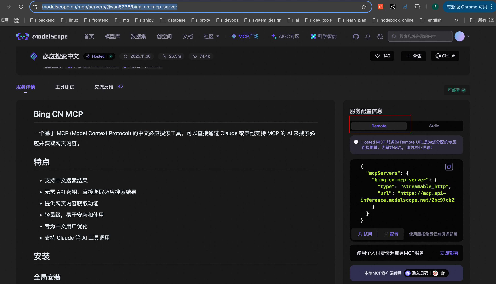

## 测试

### 1. 配置 mcp_config.json

```json
{
  "mcp_services": {
    "bing-cn-mcp-server": {
      "transport": "streamable_http",
      "url": "https://mcp.api-inference.modelscope.net/2bc97cb25c334f/mcp"
    }
  }
}
```

### 2. 配置地址[modelscope]

> https://modelscope.cn/mcp/servers/@yan5236/bing-cn-mcp-server > 

```shell
uv run main.py
```
